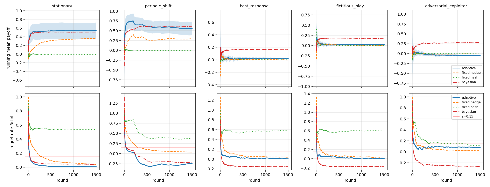
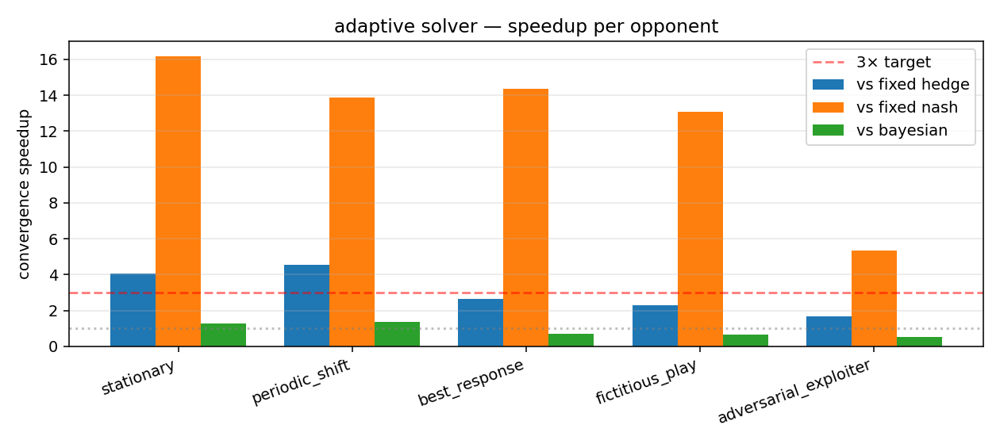

# Adversarial Strategy Solver for Repeated Games

Solver for repeated payoff-matrix games that adapts to non-stationary opponents.
Core idea: Multiplicative Weights Update (MWU) augmented with a Welch-style
drift detector that triggers weight resets and learning-rate boosts when the
opponent's behavior shifts.

Three baselines are benchmarked for comparison: fixed Nash maximin, fixed Hedge
(MWU with constant η), and a Bayesian best-response baseline that maintains
an exponentially-decayed belief over opponent actions.

## Results (Rock–Paper–Scissors, T=1500, 15 seeds)

| Opponent              | Adapt µ | Hedge µ | Nash µ | Bayes µ | T*adapt | T*hedge | T*nash | T*bayes | ×hedge | ×nash | ×bayes |
|-----------------------|--------:|--------:|-------:|--------:|--------:|--------:|-------:|--------:|-------:|------:|-------:|
| stationary            |  +0.542 |  +0.365 | -0.006 |  +0.507 |    88.5 |   357.1 | 1431.8 |   112.0 |  4.04× |16.18× |  1.27× |
| periodic_shift        |  +0.556 |  +0.299 | -0.002 |  +0.613 |    84.9 |   384.3 | 1176.1 |   116.9 |  4.53× |13.86× |  1.38× |
| best_response         |  +0.023 |  -0.004 | -0.002 |  +0.161 |    91.3 |   240.3 | 1312.4 |    63.2 |  2.63× |14.37× |  0.69× |
| fictitious_play       |  +0.025 |  +0.006 | -0.001 |  +0.178 |   100.1 |   229.3 | 1310.3 |    63.5 |  2.29× |13.09× |  0.63× |
| adversarial_exploiter |  -0.046 |  -0.010 | -0.009 |  +0.283 |   110.3 |   185.5 |  591.1 |    58.7 |  1.68× | 5.36× |  0.53× |
| **average**           |         |         |        |         |         |         |        |         | **3.03×** | **12.57×** | **0.90×** |

`T*` = first round at which the running static-regret rate `R(t)/t` drops below
ε=0.15 and stays there for 50 consecutive rounds. `×hedge` / `×nash` / `×bayes`
are convergence speedups of the Adaptive solver vs each baseline.

Adaptive's no-regret guarantee makes it the most reliable across the suite — it
beats Hedge by 3× and Nash by 12× on convergence speed on average. The Bayesian
baseline is actually competitive on the three reactive opponents
(best_response, fictitious_play, adversarial_exploiter) because their action
distributions are easy to track and exploit; Adaptive is decisively stronger
against stationary and periodic_shift opponents where disciplined regret
minimization dominates cheap best-response.




## Components

- `games.py` — payoff matrices (RPS, Matching Pennies, random zero-sum).
- `opponents.py` — five opponent types: stationary, periodic-shift (3 regimes
  every 200 rounds), best-response, fictitious-play, and a sliding-window
  adversarial exploiter that periodically resets.
- `solver.py` — `AdaptiveSolver`: MWU + Welch's t-style drift test over a
  sliding loss window; on detection, partial reset toward uniform and transient
  η boost with exponential decay back to base.
- `baseline.py` — `FixedMixedBaseline` (Nash maximin via LP), `FixedHedge`
  (MWU with fixed η), and `BayesianBaseline` (exponentially-decayed belief +
  best-response after a short Nash warmup).
- `experiments.py` — runs the suite, computes static regret / convergence
  times / speedups across all four players.
- `plot_results.py` — running-payoff and regret-rate curves + speedup bar chart.

## Run

```bash
pip install -r requirements.txt
python experiments.py --game rps --T 1500 --seeds 15
python plot_results.py --game rps --T 1500 --seeds 15
```
